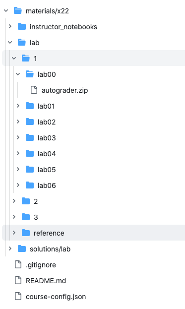

# otter-nb service

This repo contains a tornado flask app that accepts .ipynb files and grades them in a dockerized environment. Assuming you are running a Jupyterhub, you can ask Jupyterhub to run this otter-service as a service; you also have the option to run it in a stand alone manner. Grades are saved to a gcloud Cloud Firestore.

A separate Jupyterhub extension, [otter_submit](https://github.com/data-8/otter_submit), presents a "Submit" button to the user in a notebook rendered in Jupyterhub. The button is configured to serialize and send the notebook to this otter-service as well as notify the the user of the successful submission.

# FireStore/Database setup

All grades are written to gcloud Cloud FireStore. During local testing with pytest, the tests remove the collection created after verifying the data was written. Local docker testing, does not delete the entries but the collection is called, otter-docker-local-test, and can be viewed and deleted by going to the gcloud console and navigating to Cloud Firebase or Cloud Firestore.

# Configuration

## Notebook(ipynb metadata)
The ipynb notebooks need to include the metadata for which assignment they are. In the case of Data 8x, there are three pieces of information that are relevant: the course name, section and lab. These values correspond to the course-config.json file described in the section below. These are set in the metadata section of every notebook:
```
metadata:{
    "course": "8x",
    "section": "1",
    "assignment": "lab01"
    ...
}
```

## Course Configuration
Each course needs to provide two pieces of information to whomever is handling otter-service(right now: sean.smorris@berkeley.edu) that is deployed in the secrets file of
this application
1) A Github access key to the private materials repo.

2) The name of repository where the autograder.zip files are kept. (e.g. github.com/data-8/materials-x22-private)

Finally, the private repository with the autograder.zip files needs to contain a file named: course-config.json. The file is structured like this:

(1) course name which matches the course name in every notebooks metadata<br>
(2) section which matches the section in every notebooks metadata - if only one section put '1'<br>
(3) Edx course id<br>
(4) subpath to each autograder.zip in private autograder.zip repo<br>
(5) each EDX assignment name and assignment Id -- the assignment name must match the notebook metadata

```
{
  "8x" : { //(1)
    "1": { //(2)
      "course_id": "BerkeleyX+Data8.1x+3T2022", //(3)
      "subpath_to_zips": "materials/x22/lab/1", //(4)
      "assignments": {  //(5)
        "lab01": "6333e19d6b4d46f88df671ba50f616d8",
        "lab02": "fbf6740d45094b9b977111d218969273",
        "lab03": "0c8f28bdc48d4231843f62b512d73638",
        "lab04": "8db69daf14cf4751a088106be912c0cd",
        "lab05": "4cb9e3491c284cd5ae29bb48219ee15b"
      }
    },
    "2":{
      "course_id": "BerkeleyX+Data8.2x+3T2022",
      "subpath_to_zips": "materials/x22/lab/2",
      "assignments": {
        "lab01": "7abc0025c10f4b8ab123dbc88d34faaf",
        ...
```
Here is an example of the folder structure in the materials-x22-private repo. 


Note how the folder structure is mirrored in the course-config.json.

If you are not posting grades to an LTI server, than you do not need to worry about this.


## Test files
This gets tricky. The notebooks and the corresponding test files used by this service are of course connected. The files `Dockerfile` and `Dockerfile-dev` (used for local testing) download the current set of test files from the repository, `materials-x22-private`, for the `materials-x22` notebooks. If you bring in different notebooks, you would need to change the two dockerfiles to bring in the corresponding tests. 

We assume a specific path to the test files. If you mirror the path found in the `materials-x22-private` repository, all will work well. If you change the path, then you must change the `solutions-path` variable in `grade_assignment.py`.

## Docker Image
This just FYI. The Dockerfile pulls an image : 
```
docker pull ucbdsinfra/otter-grader
```
This image is used by otter-grader to run the containerized grading.

# EdX/LTI integration

The system posts the grade back to the EdX via LTI. You need to have the `LTI_CONSUMER_KEY` and `LTI_CONSUMER_SECRET` defined and encoded via `sops` for this to work correctly. The secrets are in `otter-service/secrets/gke_key.yaml`

# External installation with a re-direct from Jupyterhub

This is the current deployment configuration. We deploy the otter-service to gcloud and there is a re-direct from the Jupyterhub [configuration files](https://github.com/berkeley-dsep-infra/datahub/blob/7fed76f46e3636b3be225f1b149911aa9f1c6b1b/deployments/data8x/config/common.yaml#L22) in the [datahub repository](https://github.com/berkeley-dsep-infra/datahub/tree/staging/deployments/data8x/config) that passes authentication information to otter-service.

Once the GKE cluster is created in gcloud, executing the `deployment/cloud/deploy.sh` file  deploys the service to the cloud. 

# Deployment Details:
## Rollback: 
If we deploy and find problems the quickest way to rollback the deployment is to look at the revision history and undo the deployment by deploying to a previous revision number:
- kubectl rollout history deployment otter-pod -n grader-k8-namespace
- kubectl rollout history deployment otter-pod -n grader-k8-namespace --revision=# <-- to see details like the version of the image used
- kubectl rollout undo deployment/otter-pod -n grader-k8-namespace --to-revision=#

## CI/CD:
If you push a tag in the standard form of a version number(XX.XX.XX), GitHub action creates a release from this tag, pushes the release to pypi.org, builds the docker image, pushes it google's image repository and deploys the new image into the GKE cluster.

## pod size recommendations
There is a vertical pod autoscaler deployed to recommend memory and cpu sizing to the otter-pod pods.
You can see recommendations via either of these commands:
- kubectl get vpa -n grader-k8-namespace
- kubectl get vpa -n grader-k8-namespace --output yaml

It is called an autoscaler but I configured the resource to just recommend and not actually autoscale vertically.

## pod horizontal scaling
A horizontal autoscale is configured to spin up a new pod when 80% of CPU requested is utilized. There is maximum
of 10 pods allowed.

You can see the status of the horizontal scaling via this command:
- kubectl get hpa -n grader-k8-namespace

# pytest
Run ./deployment/local/pytest.sh -- this will start the Firestore emulator and run the tests.
If the emulator is already running it shuts it down. I shut down the emulator when the tests are done
as well but you could comment out this line to check out the data that was stored.

# Local installation for testing/developing

Install a FireStore Emulator so you test locally:
- Install FireStore CLI: https://firebase.google.com/docs/cli/#install-cli-mac-linux
- firebase login
- firebase projects:list
- firebase setup:emulators:firestore
- make java jdk installed
- firebase emulators:start --only firestore --project data8x-scratch
- You can see the UI here: http://localhost:4000/firestore
- python3 -m pip install google-cloud-firestore
- You will notice the re-direct in firebase_local fixture used by test_write_grade in test_otter_nb.py


With docker installed, you can use the `Dockerfile-dev` file to deploy a local instance of otter-service. The `deployment/local/build.sh` file gives some guidance to building and installing local changes to otter-service for testing. The usual process is to make changes, execute `build.sh`, which relies on a `docker-compose.yml` file. A sample is below but before we look, I would also study the file `tests/integration.py`. If you execute this file, you can test the service via a web connection. 

Sample docker-compose.yml:
```
version: "3.9"
services:
  app:
    image: otter-srv
    build:
      context: .
      dockerfile: Dockerfile-dev
      args:
        OTTER_SERVICE_VERSION: whatever_version you specify in otter-service/__init__.py
    env_file:
      - ../.local-env
    ports:
      - 10101:10101
    volumes:
      - /tmp/otter:/mnt/data
    entrypoint: ''

networks:
  default:
    driver: bridge
```

Notes:
- .local-env These are environment variables that must be set. They mirror the variables in  `deployment/cloud/deployment-config-encrypted.yaml`. You do not need to encrypt your local-env file with sops. 

# Service installation in JupyterHub

Instructions can be found here for running it as a service within your [jupyterhub](https://jupyterhub.readthedocs.io/en/stable/reference/services.html#launching-a-hub-managed-service)

